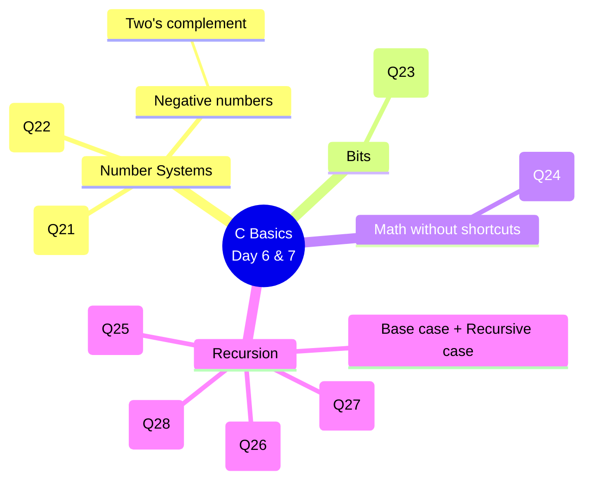
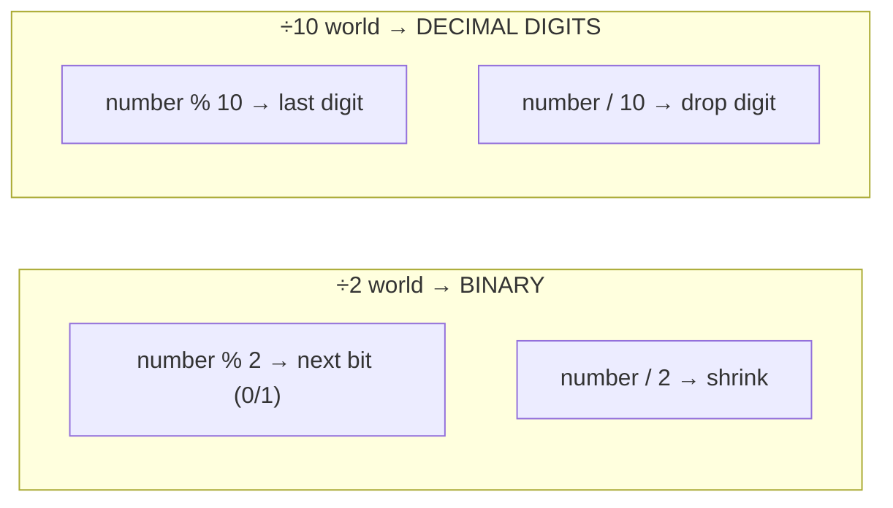

# 👶➡️👩‍💻 C Programming for Absolute Beginners — Day 6 & Day 7

> **Made for someone who has *never* coded before.** Every program is explained
> like you're 5 years old 🧸 — no jargon left unexplained, every line commented,
> and a picture (diagram) for each idea.
>
> Covers the classic **TCS / Infosys / Wipro** placement questions on
> **number systems, bits, and recursion** — including how computers store
> **negative numbers in binary using two's complement**.

---

## 🗺️ Start here (reading order)

1. 📖 **[The Concepts Primer](00_concepts_primer.md)** — what is code, a variable, a
   loop, binary, two's complement, recursion. *Read this first.*
2. 📚 **[Deep-Dive Explainers (one per question)](explainers/)** — ⭐ **the main course.**
   Each question has its **own lesson**: analogy → logic → diagram → step-by-step
   code build → full code → **line-by-line dry run** → pitfalls.
3. 📅 Quick overviews with diagrams: **[Day 6 (Q21–Q24)](docs/day6.md)** ·
   **[Day 7 (Q25–Q28)](docs/day7.md)**
4. 💻 Open the matching file in [`src/`](src/) and read the comments line by line.

### 🎯 Jump straight to a question's explainer
| Day 6 | Day 7 |
|-------|-------|
| [Q21 Decimal → Binary](explainers/Q21_decimal_to_binary.md) | [Q25 Factorial](explainers/Q25_recursive_factorial.md) |
| [Q22 Binary → Decimal](explainers/Q22_binary_to_decimal.md) | [Q26 Fibonacci](explainers/Q26_recursive_fibonacci.md) |
| [Q23 Count Set Bits](explainers/Q23_count_set_bits.md) | [Q27 Sum of Digits](explainers/Q27_recursive_sum_of_digits.md) |
| [Q24 Power xⁿ](explainers/Q24_power_without_pow.md) | [Q28 Reverse Number](explainers/Q28_recursive_reverse_number.md) |
| ⭐ [Negative → Binary (two's complement)](explainers/negative_two_complement.md) | |

---

## 📚 What's inside

### Day 6 — Numbers & Bits
| # | Problem | Concept you'll learn | Code |
|---|---------|----------------------|------|
| Q21 | Decimal → Binary | divide-by-2, remainders | [src/q21_decimal_to_binary.c](src/q21_decimal_to_binary.c) |
| Q22 | Binary → Decimal | place values, doubling | [src/q22_binary_to_decimal.c](src/q22_binary_to_decimal.c) |
| Q23 | Count set bits | what a "bit" is | [src/q23_count_set_bits.c](src/q23_count_set_bits.c) |
| Q24 | xⁿ without `pow()` | loops & multiplication | [src/q24_power_without_pow.c](src/q24_power_without_pow.c) |
| ⭐ | **Negative → Binary** | **two's complement** | [src/negative_to_binary_2s_complement.c](src/negative_to_binary_2s_complement.c) |

### Day 7 — Recursion
| # | Problem | Concept you'll learn | Code |
|---|---------|----------------------|------|
| Q25 | Factorial | recursion basics | [src/q25_recursive_factorial.c](src/q25_recursive_factorial.c) |
| Q26 | Fibonacci | branching recursion | [src/q26_recursive_fibonacci.c](src/q26_recursive_fibonacci.c) |
| Q27 | Sum of digits | peeling digits | [src/q27_recursive_sum_of_digits.c](src/q27_recursive_sum_of_digits.c) |
| Q28 | Reverse a number | carrying an accumulator | [src/q28_recursive_reverse_number.c](src/q28_recursive_reverse_number.c) |

---

## 🧠 How it all fits together



### The two "super tools" used everywhere



Master `% 2 / 2` and `% 10 / 10` and you've cracked **6 of the 9 programs**. 🔑

---

## ▶️ How to run the programs

You need a C compiler called **gcc**.

```bash
# 1) Go into the source folder
cd src

# 2) Compile (translate C into a runnable program)
gcc q21_decimal_to_binary.c -o q21

# 3) Run it
./q21            # Windows:  q21.exe   or   .\q21.exe
```

**No compiler installed? Two easy options:**

| Option | How |
|--------|-----|
| 🌐 **Online (zero setup)** | Paste the code into [onlinegdb.com](https://www.onlinegdb.com), pick **C**, press **Run**. |
| 🪟 **Windows install** | Install **MinGW-w64** (gives you `gcc`), or an IDE like **Code::Blocks** / **Dev-C++** that bundles a compiler. |

> ✅ **Expected outputs to check yourself:**
> `13 → 1101` (Q21) · `1101 → 13` (Q22) · `13 → 3 set bits` (Q23) ·
> `2^3 → 8` (Q24) · `5! → 120` (Q25) · `fib(0..6) → 0 1 1 2 3 5 8` (Q26) ·
> `1234 → 10` (Q27) · `1234 → 4321` (Q28) · `-5 → 1111 1011` (two's complement)

---

## 💡 Tips for the learner

- **Read the comments, not just the code.** Every file is written so the comments
  *teach* — read them top to bottom like a story.
- **Type it yourself.** Don't copy-paste at first. Typing builds memory.
- **Change one thing and re-run.** Curiosity is how you learn. Break it, fix it.
- **Draw the diagram by hand** for one program. If you can draw it, you understand it.

---

## 📁 Folder structure

```
c-programming-for-beginners/
├── README.md                  ← you are here (the big picture)
├── 00_concepts_primer.md      ← read first: every concept explained
├── explainers/                ← ⭐ one deep-dive lesson PER question (with dry runs)
│   ├── Q21_decimal_to_binary.md ... Q28_recursive_reverse_number.md
│   └── negative_two_complement.md
├── docs/
│   ├── day6.md                ← Q21–Q24 quick overview with diagrams
│   └── day7.md                ← Q25–Q28 quick overview with diagrams
└── src/                       ← runnable, heavily-commented C code
    ├── q21_decimal_to_binary.c
    ├── q22_binary_to_decimal.c
    ├── q23_count_set_bits.c
    ├── q24_power_without_pow.c
    ├── q25_recursive_factorial.c
    ├── q26_recursive_fibonacci.c
    ├── q27_recursive_sum_of_digits.c
    ├── q28_recursive_reverse_number.c
    └── negative_to_binary_2s_complement.c   ← two's complement demo
```

---

Happy learning! 🎉 Start with the **[Concepts Primer](00_concepts_primer.md)**.
