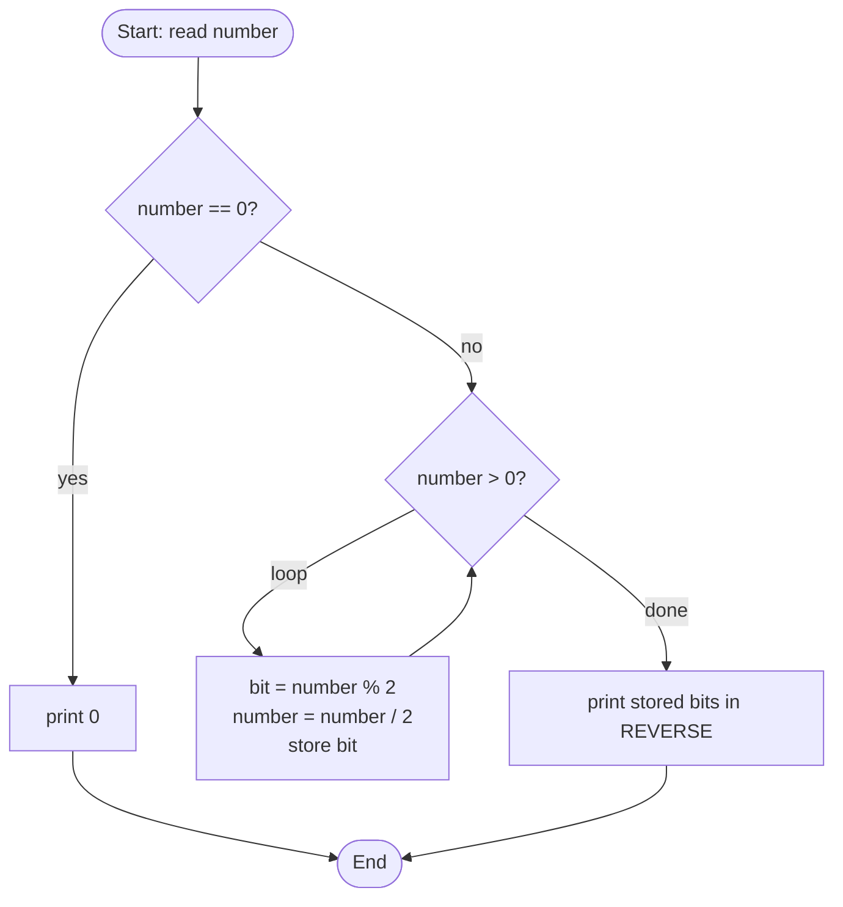
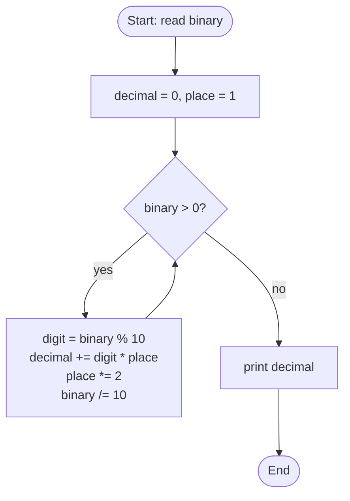
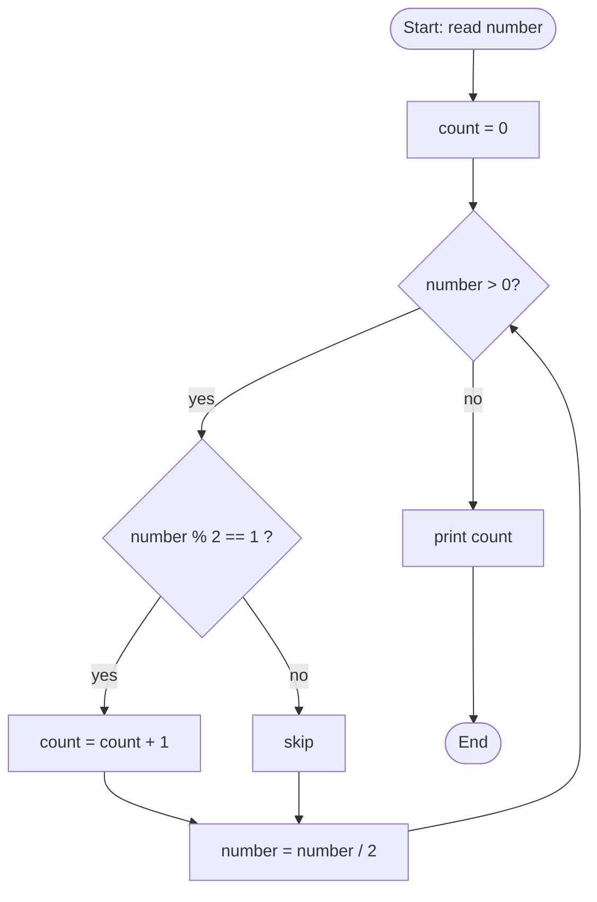
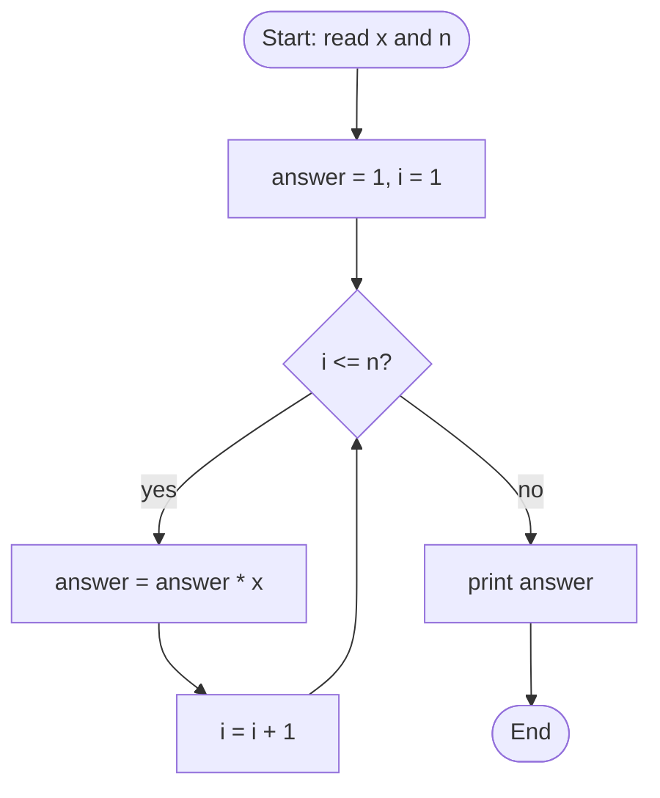
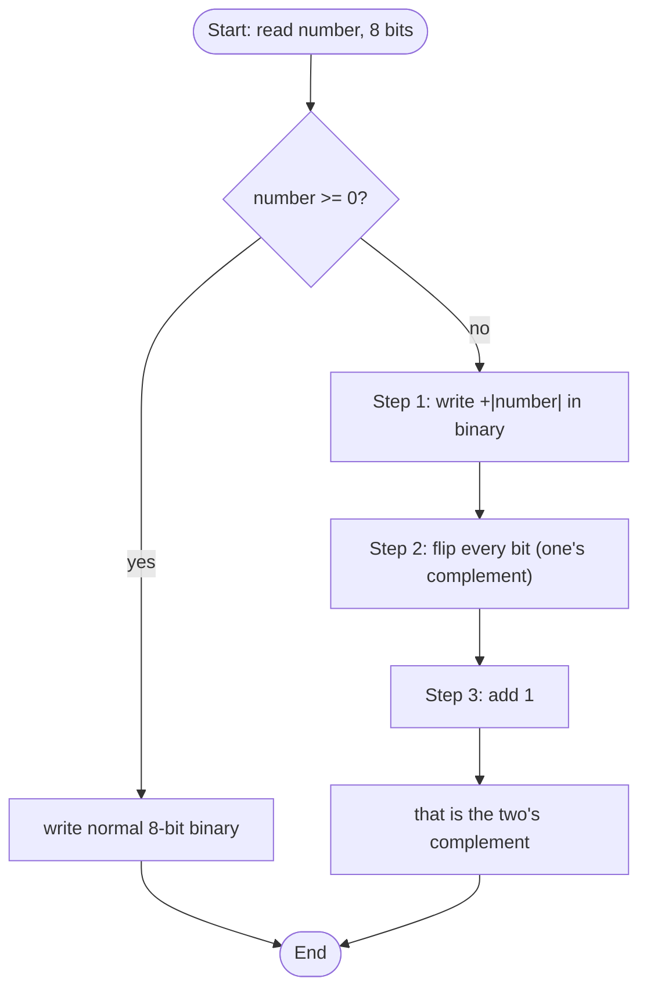

# 📅 Day 6 — Numbers & Bits (Q21–Q24)

> Companies that ask these: **TCS, Infosys, Wipro**
> New here? Read the [Concepts Primer](../00_concepts_primer.md) first. 🧸

| # | Problem | Code file |
|---|---------|-----------|
| Q21 | Convert decimal → binary | [`q21_decimal_to_binary.c`](../src/q21_decimal_to_binary.c) |
| Q22 | Convert binary → decimal | [`q22_binary_to_decimal.c`](../src/q22_binary_to_decimal.c) |
| Q23 | Count set bits (the `1`s) | [`q23_count_set_bits.c`](../src/q23_count_set_bits.c) |
| Q24 | Find xⁿ without `pow()` | [`q24_power_without_pow.c`](../src/q24_power_without_pow.c) |
| ⭐ | **Negative** number → binary (two's complement) | [`negative_to_binary_2s_complement.c`](../src/negative_to_binary_2s_complement.c) |

---

## Q21 — Decimal → Binary

**Idea:** keep dividing by 2; the **remainders read bottom-to-top** are the binary number.

```
13 ÷ 2 = 6  remainder 1   ▲ read
 6 ÷ 2 = 3  remainder 0   │ upwards
 3 ÷ 2 = 1  remainder 1   │
 1 ÷ 2 = 0  remainder 1   │
                          └─ answer: 1101
```



➡️ Negative numbers need a different method — see the ⭐ section below.

---

## Q22 — Binary → Decimal

**Idea:** each binary digit has a place value that **doubles** (1, 2, 4, 8, …).
Multiply each digit by its place value and add them up.

```
binary  1   1   0   1
place   8   4   2   1
value   8 + 4 + 0 + 1 = 13
```



---

## Q23 — Count Set Bits

A **set bit** = a `1` in the binary form. We just count them.

```
13 = 1101  →  three 1s  →  answer is 3
```



> ⚡ **Bonus fast trick (Brian Kernighan):** `number = number & (number - 1)` erases the
> lowest `1` each loop, so it runs only as many times as there are `1`s.

---

## Q24 — xⁿ without `pow()`

**Idea:** start the answer at **1**, then multiply by `x`, `n` times.

```
2^3 → answer=1 → ×2=2 → ×2=4 → ×2=8
```



> 💡 Why start at **1**? Because `1 × x = x`, and if `n = 0` the loop never runs,
> leaving `answer = 1` — which is correct, since anything⁰ = 1.

---

## ⭐ Negative numbers → binary (two's complement)

Binary has **no minus sign**, so computers use **two's complement**:

```
Want -5 in 8 bits:
  Step 1  +5             = 0000 0101
  Step 2  flip all bits  = 1111 1010   (one's complement)
  Step 3  add 1          = 1111 1011   ← -5
```

The **leftmost bit is the sign bit**: `0` = positive, `1` = negative.



**Hand-check table (8-bit):**

| Number | Binary (two's complement) |
|--------|---------------------------|
| `+5`   | `0000 0101` |
| `0`    | `0000 0000` |
| `-1`   | `1111 1111` |
| `-2`   | `1111 1110` |
| `-5`   | `1111 1011` |
| `-128` | `1000 0000` |

---

➡️ Next: [Day 7 — Recursion (Q25–Q28)](day7.md)
