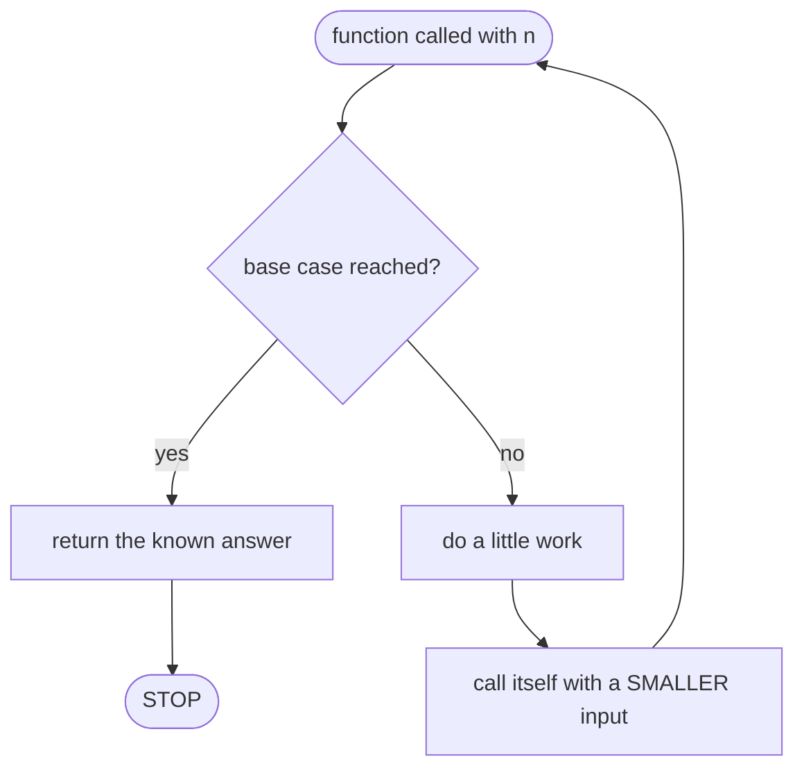
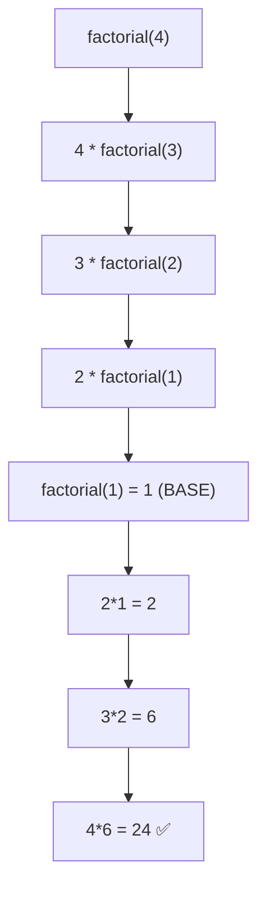
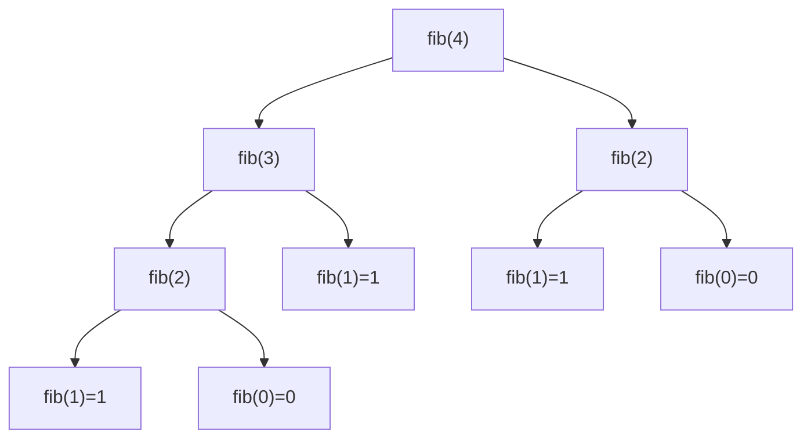
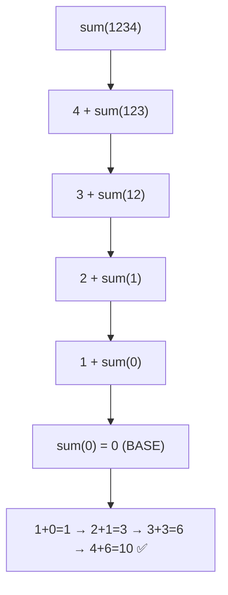
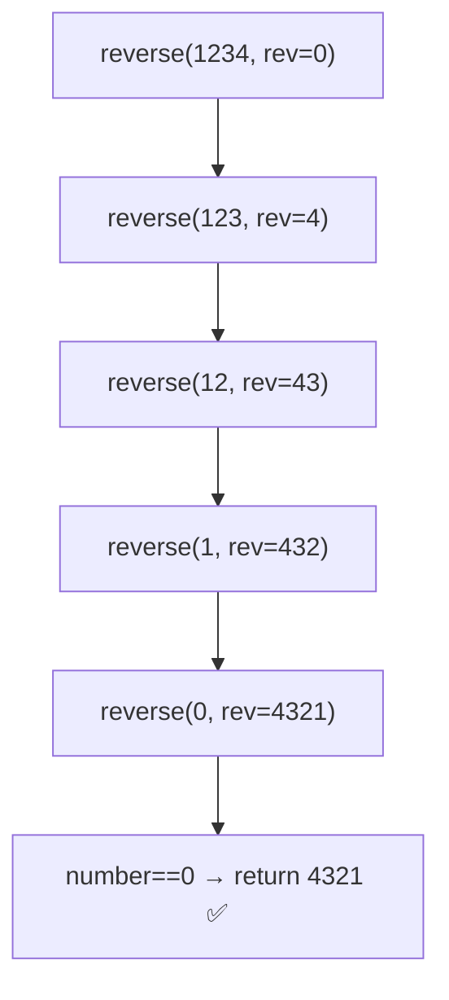

# 📅 Day 7 — Recursion (Q25–Q28)

> Companies that ask these: **TCS, Infosys, Wipro**
> New to recursion? Re-read [section 10 of the Concepts Primer](../00_concepts_primer.md#10-what-is-recursion-day-7s-big-idea). 🪆

| # | Problem | Code file |
|---|---------|-----------|
| Q25 | Factorial (recursive) | [`q25_recursive_factorial.c`](../src/q25_recursive_factorial.c) |
| Q26 | Fibonacci (recursive) | [`q26_recursive_fibonacci.c`](../src/q26_recursive_fibonacci.c) |
| Q27 | Sum of digits (recursive) | [`q27_recursive_sum_of_digits.c`](../src/q27_recursive_sum_of_digits.c) |
| Q28 | Reverse a number (recursive) | [`q28_recursive_reverse_number.c`](../src/q28_recursive_reverse_number.c) |

---

## 🪆 Recursion in one picture

Every recursive function has a **base case** (when to STOP) and a
**recursive case** (call itself on something smaller).

---

## Q25 — Factorial

`n! = n × (n-1) × … × 1`, and `0! = 1`. Rule: **`n! = n × (n-1)!`**

- **Base case:** `factorial(0) = 1`, `factorial(1) = 1`
- **Recursive case:** `return n * factorial(n - 1)`

---

## Q26 — Fibonacci

Series: `0, 1, 1, 2, 3, 5, 8, …` Rule: **`fib(n) = fib(n-1) + fib(n-2)`**

- **Base cases:** `fib(0) = 0`, `fib(1) = 1`
- **Recursive case:** `return fib(n-1) + fib(n-2)`

> ⚠️ Notice `fib(2)` is computed **twice** — this simple version repeats work,
> so it's slow for large `n`. Great for learning, not for big numbers.

---

## Q27 — Sum of Digits

`1234 → 1+2+3+4 = 10`. Rule: **last digit + sum of the rest**.

- Grab last digit: `number % 10`
- Drop last digit: `number / 10`
- **Base case:** `sumOfDigits(0) = 0`
- **Recursive case:** `return (number % 10) + sumOfDigits(number / 10)`

---

## Q28 — Reverse a Number

`1234 → 4321`. We carry a second box `rev` that builds the answer:
**`rev = rev*10 + lastDigit`**, then continue with the rest.

- **Base case:** when `number == 0`, return `rev`
- **Recursive case:** `return reverseNumber(number/10, rev*10 + number%10)`

> 💡 Negative numbers: remember the minus sign, reverse the positive part,
> then put the sign back (`-1234 → -4321`). The code does this for you.

---

⬅️ Back to [Day 6 — Numbers & Bits](day6.md) · 🏠 [Home](../README.md)
