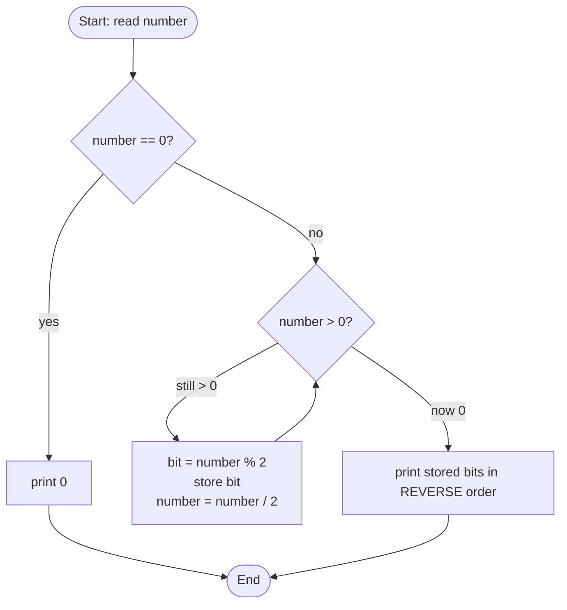

# 🔢 Q21 — Convert Decimal to Binary (Full Explainer)

> **Companies:** TCS, Infosys, Wipro
> **You'll need:** nothing! This is your first real program. 🧸

---

## 1. What is the problem asking?

> "Take a normal number (like **13**) and show it the way a computer sees it —
> as only **0s and 1s** (like **1101**)."

- **Decimal** = the numbers you use every day: `0 1 2 3 4 5 6 7 8 9`.
- **Binary** = the only numbers a computer understands: `0` and `1`.

So we must turn `13` (decimal) into `1101` (binary).

---

## 2. A real-life analogy 🪙

Imagine you have ₹13 and only **₹2 coins** to share, but you must record the
**leftover ₹1 coin** at each step:

- ₹13 shared in 2s → 6 pairs, **leftover 1**
- ₹6 shared in 2s → 3 pairs, **leftover 0**
- ₹3 shared in 2s → 1 pair,  **leftover 1**
- ₹1 shared in 2s → 0 pairs, **leftover 1**

Now read the **leftovers from bottom to top**: `1 1 0 1` → that's the binary! 🎉

---

## 3. The logic (the trick)

> **Keep dividing the number by 2. Write down each remainder.
> Read the remainders from BOTTOM to TOP.**

Two tools do all the work (from the [primer](../00_concepts_primer.md#7-the-two-magic-math-tools-for-digits)):

| Tool | Meaning | Example |
|------|---------|---------|
| `% 2` | remainder after dividing by 2 → the next **bit** (0 or 1) | `13 % 2 = 1` |
| `/ 2` | divide by 2 and drop the leftover → **shrinks** the number | `13 / 2 = 6` |

---

## 4. Picture it (diagram)



---

## 5. Let's build the code step by step

### Step A — the skeleton every C program has

```c
#include <stdio.h>   // toolbox for printf and scanf

int main(void) {     // program starts here
    return 0;        // finished happily
}
```

### Step B — ask the user for a number

```c
int number;
printf("Enter a decimal number (0 or bigger): ");
scanf("%d", &number);    // remember: scanf needs the & sign
```

### Step C — handle the easy special case (zero)

```c
if (number == 0) {
    printf("Binary = 0\n");
    return 0;
}
```
> Why? The loop below only works for numbers **bigger than 0**. Zero is just `0`.

### Step D — collect the remainders in a row of boxes (an array)

```c
int bits[32];   // 32 boxes — an int is 32 bits, so this is always enough
int count = 0;  // how many bits we've collected
```

### Step E — the loop: divide by 2 again and again

```c
while (number > 0) {
    bits[count] = number % 2;   // grab the remainder (0 or 1)
    number = number / 2;        // shrink the number
    count = count + 1;          // we stored one more bit
}
```

### Step F — print the bits in REVERSE (bottom to top)

```c
printf("Binary = ");
for (int i = count - 1; i >= 0; i--) {  // start from the LAST stored bit
    printf("%d", bits[i]);
}
printf("\n");
```

---

## 6. The complete program ✅

```c
#include <stdio.h>

int main(void) {
    int number;

    printf("Enter a decimal number (0 or bigger): ");
    scanf("%d", &number);

    if (number == 0) {                 // special case: zero
        printf("Binary = 0\n");
        return 0;
    }
    if (number < 0) {                  // negatives need two's complement
        printf("For negative numbers, use negative_to_binary_2s_complement.c\n");
        return 0;
    }

    int bits[32];
    int count = 0;

    while (number > 0) {
        bits[count] = number % 2;      // next bit
        number = number / 2;           // shrink
        count = count + 1;
    }

    printf("Binary = ");
    for (int i = count - 1; i >= 0; i--) {
        printf("%d", bits[i]);         // print in reverse
    }
    printf("\n");

    return 0;
}
```

📄 Same code as a runnable file: [`../src/q21_decimal_to_binary.c`](../src/q21_decimal_to_binary.c)

---

## 7. Dry run 🏃 — let's trace `number = 13`

We walk through the `while` loop one row at a time:

| Step | `number` before | `number % 2` (bit stored) | `number / 2` (new number) | `count` | `bits[]` so far |
|------|------|------|------|------|------|
| 1 | 13 | **1** | 6 | 1 | `[1]` |
| 2 | 6  | **0** | 3 | 2 | `[1,0]` |
| 3 | 3  | **1** | 1 | 3 | `[1,0,1]` |
| 4 | 1  | **1** | 0 | 4 | `[1,0,1,1]` |
| — | 0  | loop stops (number is now 0) | — | — | — |

Now print `bits` in **reverse** (`i` from 3 down to 0):

```
bits[3]=1  bits[2]=1  bits[1]=0  bits[0]=1   →   1101
```

✅ **Output:** `Binary = 1101`

---

## 8. Common mistakes ⚠️

- **Printing in the wrong order.** The remainders come out *backwards*; you must
  print from the **last** stored bit to the **first**.
- **Forgetting the zero case.** With `number = 0` the loop never runs and you'd
  print nothing — so we handle `0` separately.
- **Using `=` instead of `==`** inside `if`. One `=` *assigns*, two `==` *compares*.

---

## 9. Try it yourself 🎯

| Input | Expected output |
|-------|-----------------|
| 13 | 1101 |
| 5  | 101 |
| 8  | 1000 |
| 0  | 0 |

▶️ Run online (no install): paste into [onlinegdb.com](https://www.onlinegdb.com), choose **C**, press **Run**.

➡️ Next: [Q22 — Binary to Decimal](Q22_binary_to_decimal.md)
