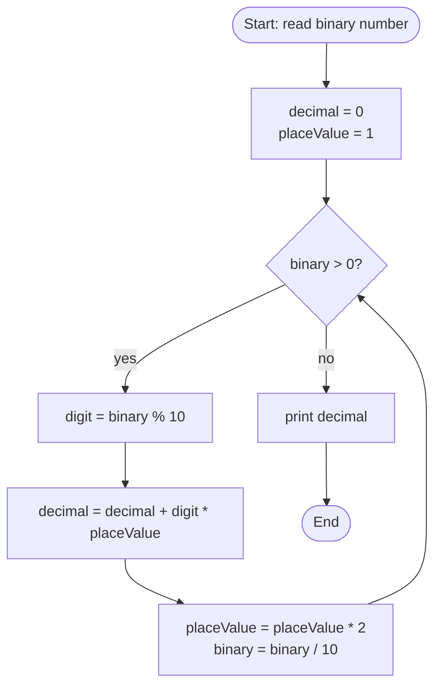

# 🔢 Q22 — Convert Binary to Decimal (Full Explainer)

> **Companies:** TCS, Infosys, Wipro
> This is the **reverse** of [Q21](Q21_decimal_to_binary.md). 🔁

---

## 1. What is the problem asking?

> "Take a binary number (only 0s and 1s, like **1101**) and turn it back into a
> normal number (like **13**)."

---

## 2. A real-life analogy 🎟️

Binary digits are like **prize tickets of different values**. Reading from the
**right**, each ticket is worth **double** the one before it:

```
ticket value:  ... 16   8   4   2   1
```

For `1101`, you "own" a ticket wherever there's a `1`:

```
 1    1    0    1
 8  + 4  + 0  + 1   =  13
```

Add up the tickets you own → that's your decimal number. 🎉

---

## 3. The logic

> **Each binary digit has a "place value" that doubles (1, 2, 4, 8, …).
> Multiply each digit by its place value and add everything up.**

We read the digits from the **right** using our digit tools:

| Tool | Meaning | Example |
|------|---------|---------|
| `% 10` | grabs the **last** digit | `1101 % 10 = 1` |
| `/ 10` | **removes** the last digit | `1101 / 10 = 110` |

And we keep a `placeValue` that starts at `1` and **doubles** each step.

---

## 4. Picture it (diagram)



---

## 5. Let's build the code step by step

### Step A — read the binary number

We read it as a `long` (a big whole number) because `1101` is just digits to us.

```c
long binary;
printf("Enter a binary number (only 0s and 1s): ");
scanf("%ld", &binary);
```

### Step B — set up the answer and the place value

```c
int decimal = 0;     // the running total starts at 0
int placeValue = 1;  // rightmost place is worth 1
```

### Step C — peel digits from the right and add their value

```c
while (binary > 0) {
    int digit = binary % 10;              // last digit (should be 0 or 1)
    decimal = decimal + digit * placeValue;
    placeValue = placeValue * 2;          // next place is worth double
    binary = binary / 10;                 // drop the digit we used
}
```

### Step D — (safety) reject anything that isn't 0 or 1

```c
if (digit != 0 && digit != 1) {
    printf("That is not a valid binary number (use only 0 and 1).\n");
    return 1;
}
```

---

## 6. The complete program ✅

```c
#include <stdio.h>

int main(void) {
    long binary;

    printf("Enter a binary number (only 0s and 1s): ");
    scanf("%ld", &binary);

    int decimal = 0;     // answer
    int placeValue = 1;  // 1, 2, 4, 8, ...

    while (binary > 0) {
        int digit = binary % 10;          // last digit

        if (digit != 0 && digit != 1) {   // safety check
            printf("That is not a valid binary number (use only 0 and 1).\n");
            return 1;
        }

        decimal = decimal + digit * placeValue;
        placeValue = placeValue * 2;
        binary = binary / 10;
    }

    printf("Decimal = %d\n", decimal);
    return 0;
}
```

📄 Runnable file: [`../src/q22_binary_to_decimal.c`](../src/q22_binary_to_decimal.c)

---

## 7. Dry run 🏃 — let's trace `binary = 1101`

| Step | `binary` before | `digit = binary % 10` | `placeValue` | `digit * placeValue` | `decimal` after | `binary / 10` |
|------|------|------|------|------|------|------|
| 1 | 1101 | **1** | 1  | 1  | 0 + 1 = **1**  | 110 |
| 2 | 110  | **0** | 2  | 0  | 1 + 0 = **1**  | 11  |
| 3 | 11   | **1** | 4  | 4  | 1 + 4 = **5**  | 1   |
| 4 | 1    | **1** | 8  | 8  | 5 + 8 = **13** | 0   |
| — | 0 | loop stops | — | — | — | — |

✅ **Output:** `Decimal = 13`

---

## 8. Common mistakes ⚠️

- **Forgetting to double `placeValue`.** It must go `1 → 2 → 4 → 8 …`, not stay at 1.
- **Doubling at the wrong time.** Use the current place value first, *then* double it
  for the next loop.
- **Typing a digit other than 0/1.** That's not binary — our safety check catches it.

---

## 9. Try it yourself 🎯

| Input (binary) | Expected (decimal) |
|----------------|--------------------|
| 1101 | 13 |
| 101  | 5  |
| 1000 | 8  |
| 1111 | 15 |

⬅️ Previous: [Q21 — Decimal to Binary](Q21_decimal_to_binary.md) · ➡️ Next: [Q23 — Count Set Bits](Q23_count_set_bits.md)
