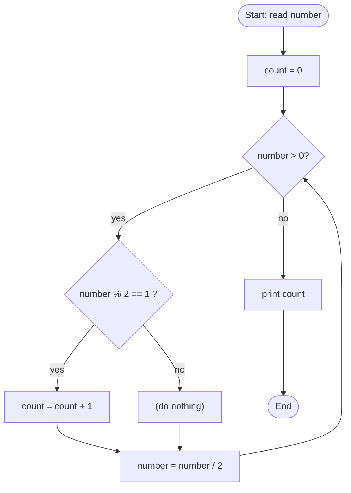

# 🔢 Q23 — Count Set Bits (Full Explainer)

> **Companies:** TCS, Infosys, Wipro
> Builds directly on [Q21](Q21_decimal_to_binary.md). 🧱

---

## 1. What is the problem asking?

> "Count how many **1s** are in the binary form of a number."

A **bit** is one binary digit (a `0` or a `1`).
A **set bit** = a bit that is **`1`** (switched **ON**).

Example: `13` in binary is `1101`. The `1`s are `1 1 _ 1` → **three** set bits.

---

## 2. A real-life analogy 💡

Picture a row of light switches. Each switch is either **OFF (0)** or **ON (1)**.
"Count set bits" simply means: **how many switches are turned ON?**

```
1101  →  ON ON OFF ON  →  3 switches are ON
```

---

## 3. The logic

It's the **same divide-by-2 trick** as Q21 — but instead of saving the bits, we
just **count the ones that are 1**.

| Tool | Meaning |
|------|---------|
| `% 2` | the next bit (0 or 1) |
| `/ 2` | shrink the number |

Every time `number % 2 == 1`, we found a set bit → add 1 to our counter.

---

## 4. Picture it (diagram)



---

## 5. Let's build the code step by step

> 🧵 We'll thread one example through every step: the user types **`13`** (binary `1101`).

### Step A — read the number and start a counter

```c
int number;
printf("Enter a number (0 or bigger): ");
scanf("%d", &number);

int count = 0;   // how many 1s found so far
```
🖥️ **Output after Step A:**
```
Enter a number (0 or bigger): 13
```
`number = 13`, `count = 0`.

### Step B — loop through the bits

```c
while (number > 0) {
    if (number % 2 == 1) {   // is the current bit a 1?
        count = count + 1;   // yes → count it
    }
    number = number / 2;     // move to the next bit
}
```
🖥️ **State after Step B (number = 13):** the loop checks each bit of `1101`:
```
13→bit 1 (count=1) → 6→bit 0 → 3→bit 1 (count=2) → 1→bit 1 (count=3)
```
`count` is now **3** (and `number` has shrunk to 0, so the loop ends).

### Step C — show the result

```c
printf("Number of set bits (1s) = %d\n", count);
```
🖥️ **Output after Step C (the final result):**
```
Number of set bits (1s) = 3
```

---

## 6. The complete program ✅

```c
#include <stdio.h>

int main(void) {
    int number;

    printf("Enter a number (0 or bigger): ");
    scanf("%d", &number);

    if (number < 0) {
        printf("Please enter 0 or a positive number for this beginner version.\n");
        return 0;
    }

    int count = 0;

    while (number > 0) {
        if (number % 2 == 1) {   // found a set bit
            count = count + 1;
        }
        number = number / 2;
    }

    printf("Number of set bits (1s) = %d\n", count);
    return 0;
}
```

📄 Runnable file: [`../src/q23_count_set_bits.c`](../src/q23_count_set_bits.c)

---

## 7. Dry run 🏃 — let's trace `number = 13`

`13` in binary is `1101`, so we expect **3**.

| Step | `number` before | `number % 2` | Is it 1? | `count` after | `number / 2` |
|------|------|------|------|------|------|
| 1 | 13 | 1 | ✅ yes | 1 | 6 |
| 2 | 6  | 0 | ❌ no  | 1 | 3 |
| 3 | 3  | 1 | ✅ yes | 2 | 1 |
| 4 | 1  | 1 | ✅ yes | 3 | 0 |
| — | 0 | loop stops | — | — | — |

✅ **Output:** `Number of set bits (1s) = 3`

---

## 7½. More worked examples — every single iteration 🔬

### Example A — `number = 7`  (binary `111`, expected `3`)

| Step | `number` before | `% 2` | set bit? | `count` after | `/ 2` |
|------|------|------|------|------|------|
| 1 | 7 | 1 | ✅ | 1 | 3 |
| 2 | 3 | 1 | ✅ | 2 | 1 |
| 3 | 1 | 1 | ✅ | 3 | 0 |
| — | 0 | stop | — | — | — |

✅ **Output:** `3`  *(all three bits are 1)*

---

### Example B — `number = 8`  (binary `1000`, expected `1`)

| Step | `number` before | `% 2` | set bit? | `count` after | `/ 2` |
|------|------|------|------|------|------|
| 1 | 8 | 0 | ❌ | 0 | 4 |
| 2 | 4 | 0 | ❌ | 0 | 2 |
| 3 | 2 | 0 | ❌ | 0 | 1 |
| 4 | 1 | 1 | ✅ | 1 | 0 |
| — | 0 | stop | — | — | — |

✅ **Output:** `1`  *(only the top bit is 1)*

---

### Example C — `number = 10`  (binary `1010`, expected `2`)

| Step | `number` before | `% 2` | set bit? | `count` after | `/ 2` |
|------|------|------|------|------|------|
| 1 | 10 | 0 | ❌ | 0 | 5 |
| 2 | 5  | 1 | ✅ | 1 | 2 |
| 3 | 2  | 0 | ❌ | 1 | 1 |
| 4 | 1  | 1 | ✅ | 2 | 0 |
| — | 0 | stop | — | — | — |

✅ **Output:** `2`  *(the 1s are in `1010`)*

---

### Example D — `number = 15`  (binary `1111`, expected `4`)

| Step | `number` before | `% 2` | set bit? | `count` after | `/ 2` |
|------|------|------|------|------|------|
| 1 | 15 | 1 | ✅ | 1 | 7 |
| 2 | 7  | 1 | ✅ | 2 | 3 |
| 3 | 3  | 1 | ✅ | 3 | 1 |
| 4 | 1  | 1 | ✅ | 4 | 0 |
| — | 0 | stop | — | — | — |

✅ **Output:** `4`  *(all four bits ON)*

---

## 8. ⚡ Bonus: the clever fast version (Brian Kernighan's trick)

There's a famous shortcut that loops **only as many times as there are 1s**:

```c
int count = 0;
while (number > 0) {
    number = number & (number - 1);  // magically erases the LOWEST 1
    count++;
}
```

**Why it works (intuition):** subtracting 1 flips the lowest `1` to `0` and turns
all the `0`s after it into `1`s; the `&` (AND) then wipes them out — removing
exactly one set bit per loop. For `13 (1101)` it loops 3 times. Same answer,
fewer steps. *(The simple version above is perfect for learning, though.)*

---

## 9. Try it yourself 🎯

| Input | Binary | Set bits |
|-------|--------|----------|
| 13 | 1101 | 3 |
| 7  | 111  | 3 |
| 8  | 1000 | 1 |
| 0  | 0    | 0 |

⬅️ Previous: [Q22 — Binary to Decimal](Q22_binary_to_decimal.md) · ➡️ Next: [Q24 — Power without pow()](Q24_power_without_pow.md)
