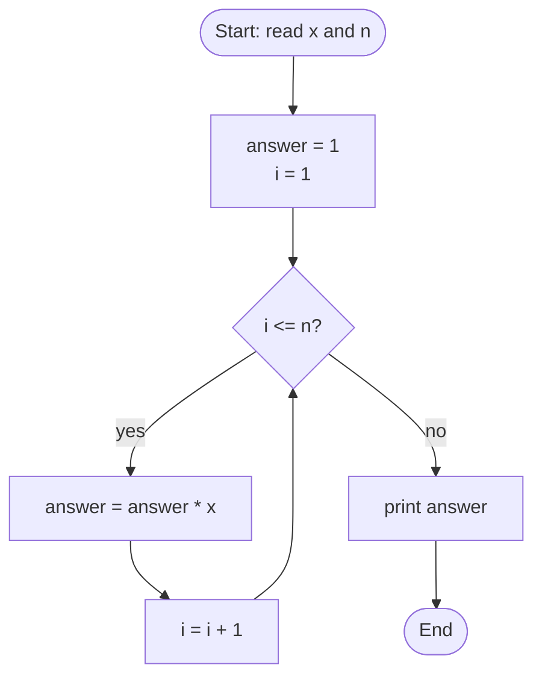

# 🔢 Q24 — Find xⁿ Without Using pow() (Full Explainer)

> **Companies:** TCS, Infosys, Wipro
> Your first program with **two** inputs. ✌️

---

## 1. What is the problem asking?

> "Calculate **x to the power n** (xⁿ) — but you are NOT allowed to use the
> ready-made `pow()` function. Do the multiplication yourself."

"x to the power n" means **multiply x by itself n times**:

```
2^3 = 2 × 2 × 2 = 8
5^2 = 5 × 5     = 25
7^0 = 1            (anything to the power 0 is 1 — a math rule)
```

- `x` = the **base** (the big number)
- `n` = the **power / exponent** (the small raised number)

---

## 2. A real-life analogy 🧫

Think of a bacterium that **doubles** every hour.
After `n` hours, how many do you have? You multiply by 2, again and again,
`n` times. Computing `xⁿ` is exactly that repeated multiplication.

---

## 3. The logic

> **Start the answer at 1. Multiply it by `x`, exactly `n` times.**

```
answer = 1
repeat n times:  answer = answer × x
```

Why start at **1**? Two reasons:
1. `1 × x = x`, so it doesn't spoil the first multiplication.
2. If `n = 0`, the loop runs **zero** times → answer stays `1` → and `x⁰ = 1`. ✅
   *(If we started at 0, every answer would be 0 — wrong!)*

---

## 4. Picture it (diagram)



---

## 5. Let's build the code step by step

> 🧵 We'll thread one example through every step: the user types **`x = 2`, `n = 3`**.

### Step A — read the two numbers

```c
int x, n;
printf("Enter base x: ");
scanf("%d", &x);
printf("Enter power n (0 or bigger): ");
scanf("%d", &n);
```
🖥️ **Output after Step A:**
```
Enter base x: 2
Enter power n (0 or bigger): 3
```
`x = 2`, `n = 3`.

### Step B — start the answer at 1

```c
long long answer = 1;   // long long because powers get BIG very fast
```
🖥️ **State after Step B:** `answer = 1`. Nothing prints yet.

### Step C — multiply n times with a for-loop

```c
for (int i = 1; i <= n; i++) {
    answer = answer * x;
}
```
> The loop body runs once for `i = 1, 2, …, n` — that's exactly `n` times.

🖥️ **State after Step C (x = 2, n = 3):** the loop multiplies 3 times:
```
answer: 1 → 2 → 4 → 8
```
`answer` is now **8**.

### Step D — print the result

```c
printf("%d ^ %d = %lld\n", x, n, answer);   // %lld prints a long long
```
🖥️ **Output after Step D (the final result):**
```
2 ^ 3 = 8
```

---

## 6. The complete program ✅

```c
#include <stdio.h>

int main(void) {
    int x, n;

    printf("Enter base x: ");
    scanf("%d", &x);
    printf("Enter power n (0 or bigger): ");
    scanf("%d", &n);

    if (n < 0) {
        printf("This beginner version handles power 0 and bigger only.\n");
        return 0;
    }

    long long answer = 1;            // start at 1

    for (int i = 1; i <= n; i++) {   // multiply n times
        answer = answer * x;
    }

    printf("%d ^ %d = %lld\n", x, n, answer);
    return 0;
}
```

📄 Runnable file: [`../src/q24_power_without_pow.c`](../src/q24_power_without_pow.c)

---

## 7. Dry run 🏃 — let's trace `x = 2`, `n = 3`

| Step (`i`) | `i <= n`? | `answer` before | `answer = answer * x` |
|------------|-----------|-----------------|------------------------|
| start | — | 1 | — |
| 1 | 1 ≤ 3 ✅ | 1 | 1 × 2 = **2** |
| 2 | 2 ≤ 3 ✅ | 2 | 2 × 2 = **4** |
| 3 | 3 ≤ 3 ✅ | 4 | 4 × 2 = **8** |
| 4 | 4 ≤ 3 ❌ | 8 | loop stops |

✅ **Output:** `2 ^ 3 = 8`

**Bonus trace — `x = 5`, `n = 0`:** the loop condition `1 <= 0` is false immediately,
so it never runs. `answer` stays `1`. Output: `5 ^ 0 = 1`. ✅

---

## 7½. More worked examples — every single iteration 🔬

### Example A — `x = 3`, `n = 4`  (expected `81`)

| Step (`i`) | `i <= n`? | `answer` before | `answer = answer * x` |
|---|---|---|---|
| start | — | 1 | — |
| 1 | 1 ≤ 4 ✅ | 1  | 1 × 3 = **3**  |
| 2 | 2 ≤ 4 ✅ | 3  | 3 × 3 = **9**  |
| 3 | 3 ≤ 4 ✅ | 9  | 9 × 3 = **27** |
| 4 | 4 ≤ 4 ✅ | 27 | 27 × 3 = **81** |
| 5 | 5 ≤ 4 ❌ | 81 | stop |

✅ **Output:** `3 ^ 4 = 81`

---

### Example B — `x = 5`, `n = 3`  (expected `125`)

| Step (`i`) | `i <= n`? | `answer` before | `answer = answer * x` |
|---|---|---|---|
| start | — | 1 | — |
| 1 | 1 ≤ 3 ✅ | 1  | 1 × 5 = **5**   |
| 2 | 2 ≤ 3 ✅ | 5  | 5 × 5 = **25**  |
| 3 | 3 ≤ 3 ✅ | 25 | 25 × 5 = **125** |
| 4 | 4 ≤ 3 ❌ | 125 | stop |

✅ **Output:** `5 ^ 3 = 125`

---

### Example C — `x = 2`, `n = 10`  (expected `1024`)

| Step (`i`) | `answer` before | `answer * x` |
|---|---|---|
| 1 | 1 | **2** |
| 2 | 2 | **4** |
| 3 | 4 | **8** |
| 4 | 8 | **16** |
| 5 | 16 | **32** |
| 6 | 32 | **64** |
| 7 | 64 | **128** |
| 8 | 128 | **256** |
| 9 | 256 | **512** |
| 10 | 512 | **1024** |
| (i=11) | 1024 | stop |

✅ **Output:** `2 ^ 10 = 1024`  *(each step doubles — that's why bytes/KB/MB grow in powers of 2!)*

---

### Example D — `x = 7`, `n = 0`  (expected `1`)

The loop condition `1 <= 0` is **false right away**, so the body never runs.
`answer` stays at its starting value **1**.

✅ **Output:** `7 ^ 0 = 1`  *(this is why starting at 1 is so important)*

---

## 8. Common mistakes ⚠️

- **Starting `answer` at 0.** Then `0 × x = 0` forever — always wrong. Start at **1**.
- **Looping the wrong number of times** (e.g. `i < n` does `n-1` multiplications).
  Use `i <= n` when starting `i` at 1, *or* `i < n` when starting `i` at 0.
- **Overflow on huge powers.** Even `long long` has a limit; very large `n` will
  overflow. That's a hardware limit, not a logic bug.

---

## 9. Try it yourself 🎯

| x | n | Expected |
|---|---|----------|
| 2 | 3 | 8 |
| 5 | 2 | 25 |
| 10 | 4 | 10000 |
| 7 | 0 | 1 |

⬅️ Previous: [Q23 — Count Set Bits](Q23_count_set_bits.md) · ➡️ Next: [Q25 — Recursive Factorial](Q25_recursive_factorial.md)
