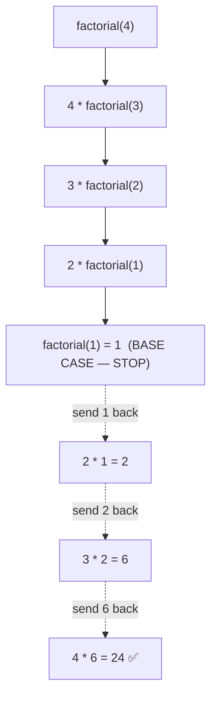

# 🔁 Q25 — Factorial Using Recursion (Full Explainer)

> **Companies:** TCS, Infosys, Wipro
> Your **first recursion** program. Read slowly — this idea unlocks Q26–Q28. 🪆

---

## 1. What is the problem asking?

> "Find the **factorial** of a number using **recursion** (a function that calls
> itself)."

**Factorial** (written with `!`) = multiply all whole numbers from 1 up to n:

```
5! = 5 × 4 × 3 × 2 × 1 = 120
3! = 3 × 2 × 1         = 6
0! = 1                   (special rule)
```

---

## 2. What is recursion? (the big idea) 🪆

**Recursion** = a function that **calls itself** to solve a smaller copy of the
same problem. Like **Russian nesting dolls**: open one, find a smaller one inside,
again and again, until the tiniest doll that can't open.

Every recursion needs **two parts**:

1. **Base case** — the tiniest doll. The simplest input where we already know the
   answer and **STOP**. → `factorial(0) = 1`, `factorial(1) = 1`
2. **Recursive case** — the function calls itself on a **smaller** number. →
   `factorial(n) = n × factorial(n-1)`

> ⚠️ Without a base case, the function calls itself **forever** and crashes.

---

## 3. The logic — spot the pattern

```
5! = 5 × 4!
4! = 4 × 3!
3! = 3 × 2!
2! = 2 × 1!
1! = 1          ← we just KNOW this (base case) → STOP
```

So the rule is simply: **`n! = n × (n-1)!`**

---

## 4. Picture it (diagram)



> ⬇️ The calls go **down** (getting smaller) until the base case,
> then the answers travel **back up** ⬆️ and get multiplied.

---

## 5. Let's build the code step by step

### Step A — write a function that takes `n`

```c
long long factorial(int n) {
    // ... the body goes here
}
```
> `long long` because factorials grow huge fast (`20!` is already enormous).

### Step B — add the base case (the STOP condition) FIRST

```c
if (n == 0 || n == 1) {
    return 1;          // we know these answers → stop here
}
```

### Step C — add the recursive case

```c
return n * factorial(n - 1);   // the function calls ITSELF with n-1
```

### Step D — call it from main

```c
int main(void) {
    int n;
    printf("Enter a number (0 or bigger): ");
    scanf("%d", &n);
    printf("%d! = %lld\n", n, factorial(n));
    return 0;
}
```

---

## 6. The complete program ✅

```c
#include <stdio.h>

long long factorial(int n) {
    if (n == 0 || n == 1) {        // BASE CASE
        return 1;
    }
    return n * factorial(n - 1);   // RECURSIVE CASE
}

int main(void) {
    int n;

    printf("Enter a number (0 or bigger): ");
    scanf("%d", &n);

    if (n < 0) {
        printf("Factorial is only defined for 0 and positive numbers.\n");
        return 0;
    }

    printf("%d! = %lld\n", n, factorial(n));
    return 0;
}
```

📄 Runnable file: [`../src/q25_recursive_factorial.c`](../src/q25_recursive_factorial.c)

---

## 7. Dry run 🏃 — let's trace `factorial(4)`

**Going DOWN (each call waits for a smaller one):**

| Call | Hits base case? | What it returns (must wait for...) |
|------|-----------------|------------------------------------|
| `factorial(4)` | no | `4 * factorial(3)` |
| `factorial(3)` | no | `3 * factorial(2)` |
| `factorial(2)` | no | `2 * factorial(1)` |
| `factorial(1)` | ✅ yes | `1`  ← STOP, no more calls |

**Coming back UP (now we can do the math):**

| Finishing call | Calculation | Result |
|----------------|-------------|--------|
| `factorial(1)` | base | 1 |
| `factorial(2)` | 2 × 1 | 2 |
| `factorial(3)` | 3 × 2 | 6 |
| `factorial(4)` | 4 × 6 | **24** |

✅ **Output:** `4! = 24`

---

## 7½. More worked examples — every single call 🔬

### Example A — `factorial(5)`  (expected `120`)

**Going DOWN (each call waits for a smaller one):**

| Call | Base case? | Returns (waits for…) |
|------|-----------|----------------------|
| `factorial(5)` | no | `5 * factorial(4)` |
| `factorial(4)` | no | `4 * factorial(3)` |
| `factorial(3)` | no | `3 * factorial(2)` |
| `factorial(2)` | no | `2 * factorial(1)` |
| `factorial(1)` | ✅ | `1`  ← STOP |

**Coming back UP (now do the math):**

| Finishing call | Calculation | Result |
|----------------|-------------|--------|
| `factorial(1)` | base | 1 |
| `factorial(2)` | 2 × 1 | 2 |
| `factorial(3)` | 3 × 2 | 6 |
| `factorial(4)` | 4 × 6 | 24 |
| `factorial(5)` | 5 × 24 | **120** |

✅ **Output:** `5! = 120`

---

### Example B — `factorial(6)`  (expected `720`)

Down to the base case, then multiply back up:

| Finishing call | Calculation | Result |
|----------------|-------------|--------|
| `factorial(1)` | base | 1 |
| `factorial(2)` | 2 × 1 | 2 |
| `factorial(3)` | 3 × 2 | 6 |
| `factorial(4)` | 4 × 6 | 24 |
| `factorial(5)` | 5 × 24 | 120 |
| `factorial(6)` | 6 × 120 | **720** |

✅ **Output:** `6! = 720`

---

### Example C — `factorial(0)`  (expected `1`)

The very first call hits the base case immediately:

| Call | Base case? | Returns |
|------|-----------|---------|
| `factorial(0)` | ✅ (`n == 0`) | `1` |

No multiplication happens at all. ✅ **Output:** `0! = 1`

---

### Example D — `factorial(3)` drawn as a "stack" 🥞

This shows how the computer **stacks** unfinished calls, then unwinds them:

```
PUSH  factorial(3)  → needs 3 * factorial(2)
PUSH  factorial(2)  → needs 2 * factorial(1)
PUSH  factorial(1)  → BASE → returns 1
POP   factorial(2)  → 2 * 1 = 2
POP   factorial(3)  → 3 * 2 = 6  ✅
```

✅ **Output:** `3! = 6`

---

## 8. Common mistakes ⚠️

- **No base case** (or wrong one) → infinite recursion → program crashes
  (`stack overflow`).
- **Not getting smaller** — if you call `factorial(n)` instead of `factorial(n-1)`,
  it never reaches the base case.
- **Wrong return type** — `int` overflows quickly for factorials; use `long long`.

---

## 9. Try it yourself 🎯

| Input | Expected |
|-------|----------|
| 5 | 120 |
| 3 | 6 |
| 1 | 1 |
| 0 | 1 |

⬅️ Previous: [Q24 — Power without pow()](Q24_power_without_pow.md) · ➡️ Next: [Q26 — Recursive Fibonacci](Q26_recursive_fibonacci.md)
