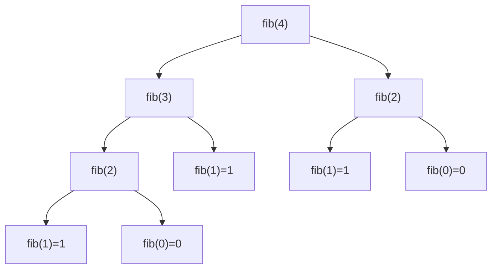

# 🔁 Q26 — Fibonacci Using Recursion (Full Explainer)

> **Companies:** TCS, Infosys, Wipro
> New to recursion? Read [Q25](Q25_recursive_factorial.md) first. 🪆

---

## 1. What is the problem asking?

> "Print the **Fibonacci series** using **recursion**."

The **Fibonacci** series starts with `0` and `1`, then every next number is the
**sum of the two before it**:

```
0, 1, 1, 2, 3, 5, 8, 13, 21, ...
      ↑  ↑  ↑  ↑
    0+1 1+1 1+2 2+3
```

---

## 2. A real-life analogy 🐰

A pair of rabbits this month = (pairs last month) + (pairs the month before).
The population each month is the sum of the two previous months — that's exactly
the Fibonacci rule. (It also shows up in flower petals and pinecones! 🌻)

---

## 3. The logic

Same two-part recursion idea as factorial:

- **Base cases (STOP):** `fib(0) = 0` and `fib(1) = 1` — we just know these.
- **Recursive case:** **`fib(n) = fib(n-1) + fib(n-2)`** — the function calls
  itself **twice** and adds the results.

To print the whole series, we ask for `fib(0)`, `fib(1)`, `fib(2)`, … in a loop.

---

## 4. Picture it (diagram)

This is a **tree** because each call splits into **two** smaller calls:



> ⚠️ Notice `fib(2)` appears **twice** — the simple version redoes work, which
> makes it slow for big `n`. Perfect for learning, though.

---

## 5. Let's build the code step by step

> 🧵 We'll thread one example through every step: the user types **`7`**.

### Step A — the recursive function with TWO base cases

```c
int fib(int n) {
    if (n == 0) return 0;   // base case 1
    if (n == 1) return 1;   // base case 2
    return fib(n - 1) + fib(n - 2);   // recursive case
}
```
🖥️ **State after Step A:** the engine works but nothing prints yet. If you called
it directly you'd get single values, e.g. `fib(6)` returns **8**.

### Step B — print the series with a loop in main

```c
int main(void) {
    int count;
    printf("How many Fibonacci numbers do you want? ");
    scanf("%d", &count);

    printf("Fibonacci series: ");
    for (int i = 0; i < count; i++) {
        printf("%d ", fib(i));   // print fib(0), fib(1), fib(2), ...
    }
    printf("\n");
    return 0;
}
```
🖥️ **Output after Step B (the full program with input `7`):**
```
How many Fibonacci numbers do you want? 7
Fibonacci series: 0 1 1 2 3 5 8
```
*(The loop printed `fib(0)` through `fib(6)` — that's 7 numbers.)*

---

## 6. The complete program ✅

```c
#include <stdio.h>

int fib(int n) {
    if (n == 0) return 0;             // BASE CASE 1
    if (n == 1) return 1;             // BASE CASE 2
    return fib(n - 1) + fib(n - 2);   // RECURSIVE CASE
}

int main(void) {
    int count;

    printf("How many Fibonacci numbers do you want? ");
    scanf("%d", &count);

    if (count <= 0) {
        printf("Please enter a number bigger than 0.\n");
        return 0;
    }

    printf("Fibonacci series: ");
    for (int i = 0; i < count; i++) {
        printf("%d ", fib(i));
    }
    printf("\n");

    return 0;
}
```

📄 Runnable file: [`../src/q26_recursive_fibonacci.c`](../src/q26_recursive_fibonacci.c)

---

## 7. Dry run 🏃 — let's trace `fib(4)`

We break it down until every branch hits a base case:

```
fib(4) = fib(3) + fib(2)
         │         │
fib(3) = fib(2) + fib(1)        fib(2) = fib(1) + fib(0)
         │        └ 1 (base)             └ 1     └ 0  (bases)
fib(2) = fib(1) + fib(0)
         └ 1     └ 0  (bases)
```

Now add from the bottom up:

| Call | Calculation | Result |
|------|-------------|--------|
| `fib(0)` | base | 0 |
| `fib(1)` | base | 1 |
| `fib(2)` | 1 + 0 | 1 |
| `fib(3)` | fib(2)+fib(1) = 1 + 1 | 2 |
| `fib(4)` | fib(3)+fib(2) = 2 + 1 | **3** |

And the **main loop** prints `fib(0..3)` if `count = 4`:

✅ **Output:** `Fibonacci series: 0 1 1 2`

*(Asking for `count = 7` prints `0 1 1 2 3 5 8`.)*

---

## 7½. More worked examples — every single call 🔬

### Example A — `fib(5)`  (expected value `5`)

Break it into the two-call tree until every branch is a base case:

```
fib(5) = fib(4) + fib(3)
fib(4) = fib(3) + fib(2)
fib(3) = fib(2) + fib(1)
fib(2) = fib(1) + fib(0) = 1 + 0 = 1
```

Build the values from the smallest up:

| Call | Calculation | Result |
|------|-------------|--------|
| `fib(0)` | base | 0 |
| `fib(1)` | base | 1 |
| `fib(2)` | 1 + 0 | 1 |
| `fib(3)` | fib(2)+fib(1) = 1 + 1 | 2 |
| `fib(4)` | fib(3)+fib(2) = 2 + 1 | 3 |
| `fib(5)` | fib(4)+fib(3) = 3 + 2 | **5** |

✅ `fib(5) = 5`

---

### Example B — full series for `count = 7`

The `main` loop calls `fib(0), fib(1), … fib(6)` and prints each:

| `i` | `fib(i)` | how |
|-----|----------|-----|
| 0 | 0 | base |
| 1 | 1 | base |
| 2 | 1 | 1 + 0 |
| 3 | 2 | 1 + 1 |
| 4 | 3 | 2 + 1 |
| 5 | 5 | 3 + 2 |
| 6 | 8 | 5 + 3 |

✅ **Output:** `Fibonacci series: 0 1 1 2 3 5 8`

---

### Example C — `count = 10`  (the full first ten)

Each number = sum of the two before it:

```
0  1  1  2  3  5  8  13  21  34
↑  ↑  └3 └5 └8 ...
0+1=1   1+1=2   1+2=3   2+3=5   3+5=8   5+8=13   8+13=21   13+21=34
```

✅ **Output:** `Fibonacci series: 0 1 1 2 3 5 8 13 21 34`

---

### Example D — why it's slow: counting the calls for `fib(5)` 🐌

Because every call splits into **two**, the same small values get recomputed:

| Function | How many times it is called for `fib(5)` |
|----------|------------------------------------------|
| `fib(4)` | 1 |
| `fib(3)` | 2 |
| `fib(2)` | 3 |
| `fib(1)` | 5 |
| `fib(0)` | 3 |

That's **15 calls** just for `fib(5)`! For `fib(40)` it's *billions*. This is why
the recursive version is great for **learning** but a simple loop is better for
**big** numbers.

---

## 8. Common mistakes ⚠️

- **Only one base case.** You need **both** `fib(0)` and `fib(1)`, otherwise
  `fib(n-2)` eventually calls `fib(-1)` and recurses forever.
- **Confusing "count" with "value".** The loop variable `i` is the *position*;
  `fib(i)` is the *value* at that position.
- **Using this for large n** (like 50). It's exponentially slow — fine for learning,
  but a loop-based version is far faster for big inputs.

---

## 9. Try it yourself 🎯

| count | Expected series |
|-------|-----------------|
| 1 | 0 |
| 4 | 0 1 1 2 |
| 7 | 0 1 1 2 3 5 8 |
| 10 | 0 1 1 2 3 5 8 13 21 34 |

⬅️ Previous: [Q25 — Recursive Factorial](Q25_recursive_factorial.md) · ➡️ Next: [Q27 — Recursive Sum of Digits](Q27_recursive_sum_of_digits.md)
