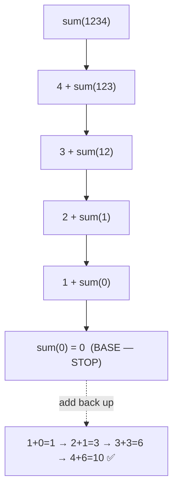

# 🔁 Q27 — Sum of Digits Using Recursion (Full Explainer)

> **Companies:** TCS, Infosys, Wipro
> Combines the **digit tools** (`% 10`, `/ 10`) with **recursion**. 🧅🪆

---

## 1. What is the problem asking?

> "Add up all the digits of a number, using **recursion**."

```
1234  →  1 + 2 + 3 + 4  =  10
505   →  5 + 0 + 5      =  10
```

---

## 2. A real-life analogy 🧅

Peeling an onion: you remove **one layer at a time** until nothing is left.
Here each "layer" is the **last digit**. We keep peeling the last digit off and
adding it, until the number becomes `0`.

| Tool | Meaning | Example |
|------|---------|---------|
| `% 10` | grabs the **last** digit | `1234 % 10 = 4` |
| `/ 10` | **removes** the last digit | `1234 / 10 = 123` |

---

## 3. The logic

Think of it as: **(last digit) + (sum of all the remaining digits)**.

```
sum(1234) = 4 + sum(123)
sum(123)  = 3 + sum(12)
sum(12)   = 2 + sum(1)
sum(1)    = 1 + sum(0)
sum(0)    = 0          ← base case → STOP
```

- **Base case:** `sum(0) = 0` (no digits left → nothing to add).
- **Recursive case:** `return (number % 10) + sumOfDigits(number / 10)`.

---

## 4. Picture it (diagram)



---

## 5. Let's build the code step by step

### Step A — the recursive function

```c
int sumOfDigits(int number) {
    if (number == 0) {            // BASE CASE
        return 0;
    }
    return (number % 10) + sumOfDigits(number / 10);  // RECURSIVE CASE
}
```

- `number % 10` → the last digit (added now).
- `sumOfDigits(number / 10)` → the function calls itself on the **rest**.

### Step B — call it from main (and handle negatives)

```c
int main(void) {
    int number;
    printf("Enter a number: ");
    scanf("%d", &number);

    if (number < 0) number = -number;   // work with the positive twin

    printf("Sum of digits = %d\n", sumOfDigits(number));
    return 0;
}
```

---

## 6. The complete program ✅

```c
#include <stdio.h>

int sumOfDigits(int number) {
    if (number == 0) {            // BASE CASE
        return 0;
    }
    return (number % 10) + sumOfDigits(number / 10);  // RECURSIVE CASE
}

int main(void) {
    int number;

    printf("Enter a number: ");
    scanf("%d", &number);

    if (number < 0) {
        number = -number;         // e.g. -123 → add digits of 123
    }

    printf("Sum of digits = %d\n", sumOfDigits(number));
    return 0;
}
```

📄 Runnable file: [`../src/q27_recursive_sum_of_digits.c`](../src/q27_recursive_sum_of_digits.c)

---

## 7. Dry run 🏃 — let's trace `sumOfDigits(1234)`

**Going DOWN (peeling the last digit each time):**

| Call | `number % 10` (added now) | `number / 10` (passed down) |
|------|---------------------------|------------------------------|
| `sum(1234)` | 4 | `sum(123)` |
| `sum(123)`  | 3 | `sum(12)` |
| `sum(12)`   | 2 | `sum(1)` |
| `sum(1)`    | 1 | `sum(0)` |
| `sum(0)`    | — | **base case → returns 0** |

**Coming back UP (adding the returns):**

| Finishing call | Calculation | Result |
|----------------|-------------|--------|
| `sum(0)` | base | 0 |
| `sum(1)` | 1 + 0 | 1 |
| `sum(12)` | 2 + 1 | 3 |
| `sum(123)` | 3 + 3 | 6 |
| `sum(1234)` | 4 + 6 | **10** |

✅ **Output:** `Sum of digits = 10`

---

## 8. Common mistakes ⚠️

- **Wrong base case.** It must be `number == 0` (returns 0). Stopping at `1`
  would miss numbers and break for input `0`.
- **Mixing `% 10` and `/ 10`.** `% 10` *gets* the digit; `/ 10` *removes* it.
  Swapping them gives nonsense.
- **Negative input.** Without flipping the sign, `% 10` on a negative number can
  behave unexpectedly — we convert to positive first.

---

## 9. Try it yourself 🎯

| Input | Expected |
|-------|----------|
| 1234 | 10 |
| 505 | 10 |
| 9 | 9 |
| 1000 | 1 |

⬅️ Previous: [Q26 — Recursive Fibonacci](Q26_recursive_fibonacci.md) · ➡️ Next: [Q28 — Recursive Reverse Number](Q28_recursive_reverse_number.md)
