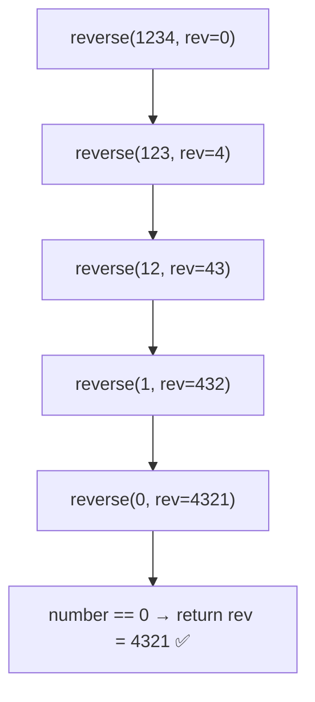

# 🔁 Q28 — Reverse a Number Using Recursion (Full Explainer)

> **Companies:** TCS, Infosys, Wipro
> The last recursion program — it introduces a **carry-along accumulator**. 🎒

---

## 1. What is the problem asking?

> "Write the digits of a number **backwards**, using **recursion**."

```
1234  →  4321
560   →  65     (the leading 0 just disappears, like any normal number)
```

---

## 2. A real-life analogy 🧱

Imagine taking bricks off the **right** end of a wall and stacking them onto a
**new** wall. The brick that was last ends up first. We carry that "new wall"
along in a second box called `rev` (short for *reversed*).

| Tool | Meaning | Example |
|------|---------|---------|
| `% 10` | last digit | `1234 % 10 = 4` |
| `/ 10` | drop last digit | `1234 / 10 = 123` |

---

## 3. The logic — the accumulator trick 🎒

We carry a second value `rev` that **builds the answer**. Each step we glue the
last digit onto the **right side** of `rev`:

```
rev = rev × 10 + lastDigit
```

Multiplying `rev` by 10 makes room for a new digit on the right.

```
start: rev = 0
1234 → rev = 0×10 + 4 = 4
123  → rev = 4×10 + 3 = 43
12   → rev = 43×10 + 2 = 432
1    → rev = 432×10 + 1 = 4321
0    → STOP → answer = 4321
```

- **Base case:** when `number == 0`, return `rev` (the finished answer).
- **Recursive case:** `return reverseNumber(number/10, rev*10 + number%10)`.

> 💡 This is a "two-argument" recursion: one argument **shrinks** (`number`),
> the other **grows** (`rev`).

---

## 4. Picture it (diagram)



> Notice the answer is **ready by the time we hit the base case** — it just gets
> passed straight back up.

---

## 5. Let's build the code step by step

### Step A — the recursive function with TWO arguments

```c
int reverseNumber(int number, int rev) {
    if (number == 0) {            // BASE CASE
        return rev;               // the answer we've built so far
    }
    int lastDigit = number % 10;
    return reverseNumber(number / 10, rev * 10 + lastDigit);  // RECURSIVE CASE
}
```

### Step B — call it starting with `rev = 0`

```c
int result = reverseNumber(number, 0);
```

### Step C — handle negative numbers (keep the minus sign)

```c
int isNegative = 0;
if (number < 0) { isNegative = 1; number = -number; }
int result = reverseNumber(number, 0);
if (isNegative) result = -result;   // -1234 → -4321
```

---

## 6. The complete program ✅

```c
#include <stdio.h>

int reverseNumber(int number, int rev) {
    if (number == 0) {            // BASE CASE
        return rev;
    }
    int lastDigit = number % 10;
    return reverseNumber(number / 10, rev * 10 + lastDigit);  // RECURSIVE CASE
}

int main(void) {
    int number;

    printf("Enter a number: ");
    scanf("%d", &number);

    int isNegative = 0;
    if (number < 0) {
        isNegative = 1;
        number = -number;
    }

    int result = reverseNumber(number, 0);   // start with rev = 0

    if (isNegative) {
        result = -result;        // put the minus sign back
    }

    printf("Reversed number = %d\n", result);
    return 0;
}
```

📄 Runnable file: [`../src/q28_recursive_reverse_number.c`](../src/q28_recursive_reverse_number.c)

---

## 7. Dry run 🏃 — let's trace `reverseNumber(1234, 0)`

| Call | `number` | `rev` (carried in) | `lastDigit = number%10` | new `rev = rev*10 + lastDigit` | next call |
|------|----------|--------------------|--------------------------|--------------------------------|-----------|
| 1 | 1234 | 0   | 4 | 0×10 + 4 = **4**    | `reverse(123, 4)` |
| 2 | 123  | 4   | 3 | 4×10 + 3 = **43**   | `reverse(12, 43)` |
| 3 | 12   | 43  | 2 | 43×10 + 2 = **432**  | `reverse(1, 432)` |
| 4 | 1    | 432 | 1 | 432×10 + 1 = **4321** | `reverse(0, 4321)` |
| 5 | 0    | 4321 | — | base case → **return 4321** | — |

The `4321` is returned straight back up through every call.

✅ **Output:** `Reversed number = 4321`

---

## 7½. More worked examples — every single call 🔬

### Example A — `reverseNumber(12345, 0)`  (expected `54321`)

| Call | `number` | `rev` in | `lastDigit = %10` | new `rev = rev*10 + lastDigit` | next call |
|------|----------|----------|--------------------|--------------------------------|-----------|
| 1 | 12345 | 0     | 5 | 0×10 + 5 = **5**       | `reverse(1234, 5)` |
| 2 | 1234  | 5     | 4 | 5×10 + 4 = **54**      | `reverse(123, 54)` |
| 3 | 123   | 54    | 3 | 54×10 + 3 = **543**    | `reverse(12, 543)` |
| 4 | 12    | 543   | 2 | 543×10 + 2 = **5432**  | `reverse(1, 5432)` |
| 5 | 1     | 5432  | 1 | 5432×10 + 1 = **54321** | `reverse(0, 54321)` |
| 6 | 0     | 54321 | — | base → **return 54321** | — |

✅ **Output:** `Reversed number = 54321`

---

### Example B — `reverseNumber(9080, 0)`  (expected `809`)

| Call | `number` | `rev` in | `lastDigit` | new `rev` | next call |
|------|----------|----------|-------------|-----------|-----------|
| 1 | 9080 | 0   | 0 | 0×10 + 0 = **0**     | `reverse(908, 0)` |
| 2 | 908  | 0   | 8 | 0×10 + 8 = **8**     | `reverse(90, 8)` |
| 3 | 90   | 8   | 0 | 8×10 + 0 = **80**    | `reverse(9, 80)` |
| 4 | 9    | 80  | 9 | 80×10 + 9 = **809**  | `reverse(0, 809)` |
| 5 | 0    | 809 | — | base → **return 809** | — |

✅ **Output:** `Reversed number = 809`
*(The trailing `0` in 9080 becomes a leading `0` when reversed, and leading zeros
just vanish in a normal number — so `0809` is simply `809`.)*

---

### Example C — `reverseNumber(7, 0)`  (single digit)

| Call | `number` | `rev` in | `lastDigit` | new `rev` | next call |
|------|----------|----------|-------------|-----------|-----------|
| 1 | 7 | 0 | 7 | 0×10 + 7 = **7** | `reverse(0, 7)` |
| 2 | 0 | 7 | — | base → **return 7** | — |

✅ **Output:** `Reversed number = 7`  *(a single digit reversed is itself)*

---

### Example D — `number = -670`  (negative, expected `-76`)

1. `isNegative = 1`, then `number = 670` (work with the positive twin).
2. Reverse `670`:

| Call | `number` | `rev` in | `lastDigit` | new `rev` |
|------|----------|----------|-------------|-----------|
| 1 | 670 | 0  | 0 | 0  |
| 2 | 67  | 0  | 7 | 7  |
| 3 | 6   | 7  | 6 | 76 |
| 4 | 0   | 76 | — | base → return **76** |

3. `isNegative` was 1, so `result = -76`.

✅ **Output:** `Reversed number = -76`

---

## 8. Common mistakes ⚠️

- **Forgetting to multiply `rev` by 10.** Without `rev * 10` you just keep
  overwriting the last digit instead of shifting left.
- **Starting `rev` at something other than 0.** It must begin empty (`0`).
- **Losing the minus sign.** Reverse the positive part, then re-apply the sign.

---

## 9. Try it yourself 🎯

| Input | Expected |
|-------|----------|
| 1234 | 4321 |
| 560 | 65 |
| 7 | 7 |
| -1234 | -4321 |

⬅️ Previous: [Q27 — Recursive Sum of Digits](Q27_recursive_sum_of_digits.md) · ➡️ Bonus: [Negative numbers in binary (two's complement)](negative_two_complement.md)
