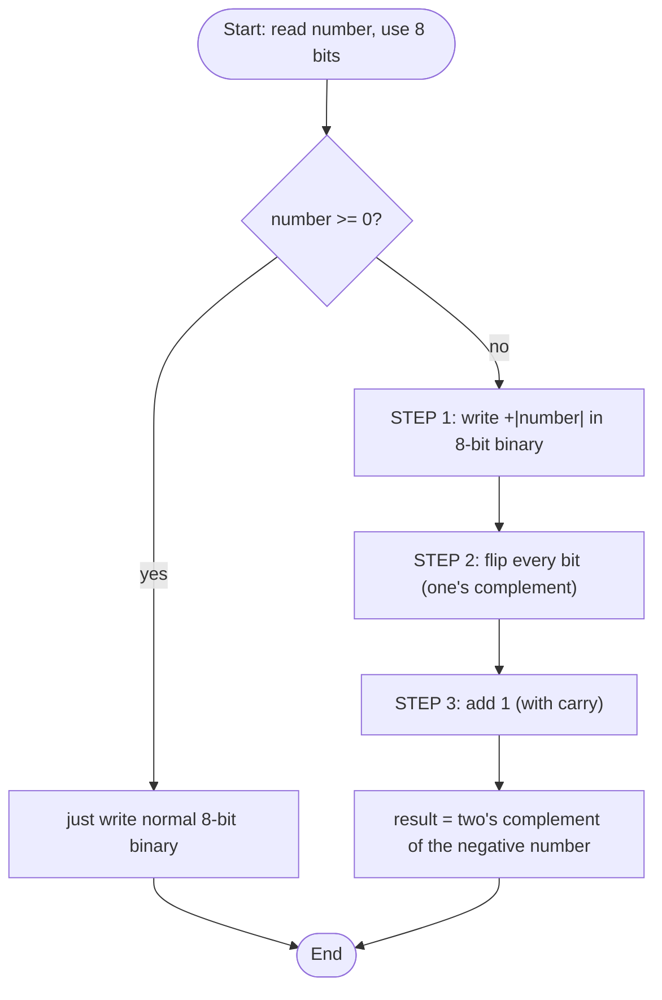

# ⭐ Bonus — Negative Numbers in Binary (Two's Complement) — Full Explainer

> **Companies:** TCS, Infosys, Wipro (very common follow-up to "decimal → binary")
> Read [Q21](Q21_decimal_to_binary.md) first so you're comfortable with binary. 🧱

---

## 1. What is the problem asking?

> "We know how to write **positive** numbers in binary. But binary only has `0`
> and `1` — **there is no minus sign!** So how does a computer store **-5**?"

The answer is a clever, world-standard trick called **two's complement**.

---

## 2. First, the big idea: fixed-size boxes 📦

A computer doesn't store endless digits. It uses a **fixed number of bits**.
Here we use **8 bits** (8 boxes), which can hold values from **-128 to +127**.

```
8 boxes:  [ _ ][ _ ][ _ ][ _ ][ _ ][ _ ][ _ ][ _ ]
           ↑
     leftmost box = the SIGN BIT  (0 = positive, 1 = negative)
```

---

## 3. The rule for a negative number (3 steps)

To write a negative number like **-5** in 8-bit two's complement:

```
STEP 1:  Write +5 in normal 8-bit binary   →  0000 0101
STEP 2:  FLIP every bit (0↔1)              →  1111 1010   (this is "one's complement")
STEP 3:  ADD 1 to the result               →  1111 1011   ← this is -5 ✅
```

For **positive numbers and zero**, you do nothing special — just write the
normal binary (`+5 = 0000 0101`, `0 = 0000 0000`).

> 🔍 **Why does this strange trick work?** Because with it, normal binary
> addition "just works" across positive and negative numbers, and `x + (-x)`
> naturally wraps around to `0`. That's why every computer on Earth uses it.

---

## 4. Picture it (diagram)



---

## 5. Let's build the code step by step

### Step A — read the number and check the range

```c
#define BITS 8

int number;
printf("Enter a number between -128 and 127: ");
scanf("%d", &number);
```

### Step B — a helper to print an 8-bit array nicely

```c
void printBits(int bits[]) {
    for (int i = 0; i < BITS; i++) {
        if (i == 4) printf(" ");   // a gap after 4 bits, just for readability
        printf("%d", bits[i]);
    }
    printf("\n");
}
```

### Step C — positive/zero case: write normal binary

```c
int n = number;
for (int i = BITS - 1; i >= 0; i--) {  // fill from the rightmost box
    bits[i] = n % 2;
    n = n / 2;
}
```

### Step D — negative case, STEP 1: binary of the positive twin

```c
int magnitude = -number;        // e.g. -5 → 5
int n = magnitude;
for (int i = BITS - 1; i >= 0; i--) {
    bits[i] = n % 2;
    n = n / 2;
}
```

### Step E — STEP 2: flip every bit

```c
for (int i = 0; i < BITS; i++) {
    bits[i] = 1 - bits[i];   // 0 → 1 and 1 → 0
}
```

### Step F — STEP 3: add 1, carrying from the right

```c
int carry = 1;   // the "1" we add
for (int i = BITS - 1; i >= 0 && carry == 1; i--) {
    int sum = bits[i] + carry;
    bits[i] = sum % 2;   // digit stays here
    carry   = sum / 2;   // 1 if it overflows into the next box
}
```

---

## 6. The complete program ✅

```c
#include <stdio.h>

#define BITS 8

void printBits(int bits[]) {
    for (int i = 0; i < BITS; i++) {
        if (i == 4) printf(" ");
        printf("%d", bits[i]);
    }
    printf("\n");
}

int main(void) {
    int number;
    printf("Enter a number between -128 and 127: ");
    scanf("%d", &number);

    if (number < -128 || number > 127) {
        printf("Out of range for 8 bits. Use -128 to 127.\n");
        return 0;
    }

    int bits[BITS];

    if (number >= 0) {                       // positive / zero
        int n = number;
        for (int i = BITS - 1; i >= 0; i--) { bits[i] = n % 2; n /= 2; }
        printf("Binary (8-bit) = ");
        printBits(bits);
        return 0;
    }

    int magnitude = -number;                 // negative → 3 steps
    int n = magnitude;
    for (int i = BITS - 1; i >= 0; i--) { bits[i] = n % 2; n /= 2; }
    printf("STEP 1 (+%d binary): ", magnitude); printBits(bits);

    for (int i = 0; i < BITS; i++) bits[i] = 1 - bits[i];   // STEP 2: flip
    printf("STEP 2 (flip bits):  "); printBits(bits);

    int carry = 1;                                          // STEP 3: add 1
    for (int i = BITS - 1; i >= 0 && carry == 1; i--) {
        int sum = bits[i] + carry;
        bits[i] = sum % 2;
        carry   = sum / 2;
    }
    printf("STEP 3 (add 1):      "); printBits(bits);

    printf("\nSo %d in 8-bit two's complement = ", number);
    printBits(bits);
    return 0;
}
```

📄 Runnable file: [`../src/negative_to_binary_2s_complement.c`](../src/negative_to_binary_2s_complement.c)

---

## 7. Dry run 🏃 — let's trace `number = -5`

**STEP 1 — write +5 in 8 bits** (`magnitude = 5`):

| Box index (i) | 0 | 1 | 2 | 3 | 4 | 5 | 6 | 7 |
|---|---|---|---|---|---|---|---|---|
| bit | 0 | 0 | 0 | 0 | 0 | 1 | 0 | 1 |

→ `0000 0101`

**STEP 2 — flip every bit** (`1 - bit`):

| Box index (i) | 0 | 1 | 2 | 3 | 4 | 5 | 6 | 7 |
|---|---|---|---|---|---|---|---|---|
| bit | 1 | 1 | 1 | 1 | 1 | 0 | 1 | 0 |

→ `1111 1010`

**STEP 3 — add 1** (start from the right, `carry = 1`):

| i (right→left) | bit before | bit + carry | new bit | new carry |
|---|---|---|---|---|
| 7 | 0 | 0 + 1 = 1 | **1** | 0 |
| (carry is now 0 → loop stops) | | | | |

Result: `1111 1011`

✅ **Output:** `So -5 in 8-bit two's complement = 1111 1011`

---

## 8. Hand-check table (memorise a few) 📋

| Number | 8-bit two's complement | Note |
|--------|------------------------|------|
| `+5`   | `0000 0101` | normal binary |
| `0`    | `0000 0000` | all zeros |
| `-1`   | `1111 1111` | all ones |
| `-2`   | `1111 1110` | |
| `-5`   | `1111 1011` | our example |
| `-128` | `1000 0000` | most negative 8-bit value |

> 🧠 **Quick fact:** the leftmost bit is `0` for every positive number and `1`
> for every negative number — that's the **sign bit**.

---

## 9. Common mistakes ⚠️

- **Skipping the "+1" step.** Flipping alone gives *one's* complement, not *two's*.
- **Forgetting the carry** when adding 1 (e.g. `0111 1111 + 1` must ripple to
  `1000 0000`).
- **Going out of range.** With 8 bits you can only represent **-128 … +127**.

---

⬅️ Previous: [Q28 — Recursive Reverse Number](Q28_recursive_reverse_number.md) · 🏠 [Home](../README.md)
